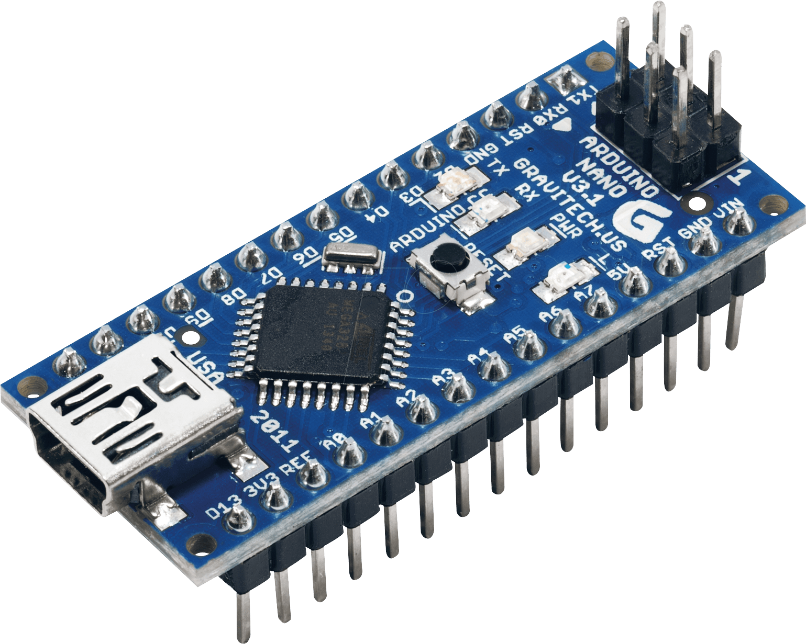

# Arduino Programming

This section will go over specific concepts that will help you control your _Arduino_.

## What is an _Arduino_?

An _Arduino_ is a **microcontroller**, which is essentially like a mini computer which we can program. We can attach various devices and components to its **pins**, and we can program the _Arduino_ to control the connected stuff. For example, we can attach a sensor and a LED, and we can program it so that the LED turns on when the sensor detects something.

For Sumobots, this will be how you control how your bot moves and responds. In your kits, you will recieve an **_Arduino Nano_**, which is the smaller version in the family of Arduinos (compared to Arduino Uno or Arduino Mega).



One important feature of the _Arduino_ are the **pins**. We can attach the components to these. Some pins are **digital pins** while some are **analog pins**. You can tell which are which by the pin number. For example; _D2_ is a digital pin because of the **D**, and _A0_ is an analog pin because of the **A**.

A digital pin can only take two values; high or low. In terms of voltage, it will be either 0 volts or 5 volts.

An analog pin can read a range of values, specifically between 0 to 1023. 0 represents 0 volts, and 1023 represents 5 volts. A value in between, such as 512, will represent a value of around 2.5 volts. Writing analog has a different range, which goes from 0 to 255.

An analog pin can act as a digital pin, but a digital pin cannot act as an analog pin.

There are also a few other pins, which are related to power. Specifically, they are the _VIN (Voltage IN)_, _GND (Ground)_, and _5V_.

You might also notice a few others such as _RST_, _TX1_, _RX1_, _REF_, etc. These pins are irrelevant to us right now and we will not be using them.

## Serial

Your _Arduino_ is connected to your laptop through something called _Serial_. You can learn more in the [Serial](../serial/) section.

## Program Structure

When you open a new file in the _Arduino IDE_, you get something that looks like this;

```cpp
void setup() {
  // put your setup code here, to run once:

}

void loop() {
  // put your main code here, to run repeatedly:

}
```

You might notice that we have two **code blocks** or **functions**; setup and loop.

**Setup**:

- Runs once at the very beginning when the Arduino starts up
- Put all your setup code here; eg. initialising Serial

**Loop**:

- Code inside here will keep repeating forever (or at least until the Arduino turns off)
- Put all your main logic here

## Reading Pins

Before we read pins, we have to define them and set the correct mode. We can do this by using `pinMode(pinNumber, INPUT)`. For example, suppose there is a button connected to pin D4, and a distance sensor on A0:

```cpp
int button_pin = D4;
int sensor_pin = A0;
void setup() {
    pinMode(button_pin, INPUT);
    pinMode(sensor_pin, INPUT);
}
```

**NOTE: THIS IS IMPORTANT!!** Incorrectly setting your pinMode might damage your board when your components try to read/write from the wrong type of pin, leading to short circuits.

### Digital Read

If we want to read a digital pin, we can use `digitalRead(pinNumber)`. This will return a **boolean**, meaning either a HIGH or LOW value.

```cpp
void loop() {
    bool button_status = digitalRead(button_pin);
    if (button_status == HIGH) {
        Serial.println("BUTTON PRESSED");
    }
}
```

### Analog Read

If we want to read an analog value, we can use `analogRead(pinNumber)`. This will return an `int` with a value between `0` and `1023`.

```cpp
void loop() {
    int distance = analogRead(sensor_pin);
    if (distance < 200) {
        Serial.println("CLOSE OBJECT");
    }
}
```

## Writing Pins

Writing is very similar to reading. We have to first set our pinMode to OUTPUT **(VERY IMPORTANT!!!)**

```cpp
int led_pin = D5;
void setup() {
    pinMode(led_pin, OUTPUT);
}
```

### Digital Write

To write a digital value, use `digitalWrite(pinNumber, value)`.

```cpp
digitalWrite(led_pin, HIGH);
```

### Analog Write

The _Arduino_ doesn't actually have the capability to write a true analog signal. However, it uses a special technique called **Pulse Width Modulation (PWM)**. This is when the pin turns on and off so fast that the voltage _appears_ to be between 0V and 5V. For example, if the PWM signal is high 50% of the time, and low the other 50% of the time, and it alternates between the two states super fast, then the output voltage will appear to be around 2.5V.

[PWM Diagram](../assets/pwm.png)

Arduino does this all the background when we use `analogWrite(pinNumber, value)`. Since we use **PWM**, we can use either digital or analog to write. `value` must be a number between `0` and `255`, with `255` being the max voltage at 5V.

```cpp
analogWrite(led_pin, 100);
```

## Exercise

Try out the **TOGGLE** exercise under the [Serial](../serial/) section.
